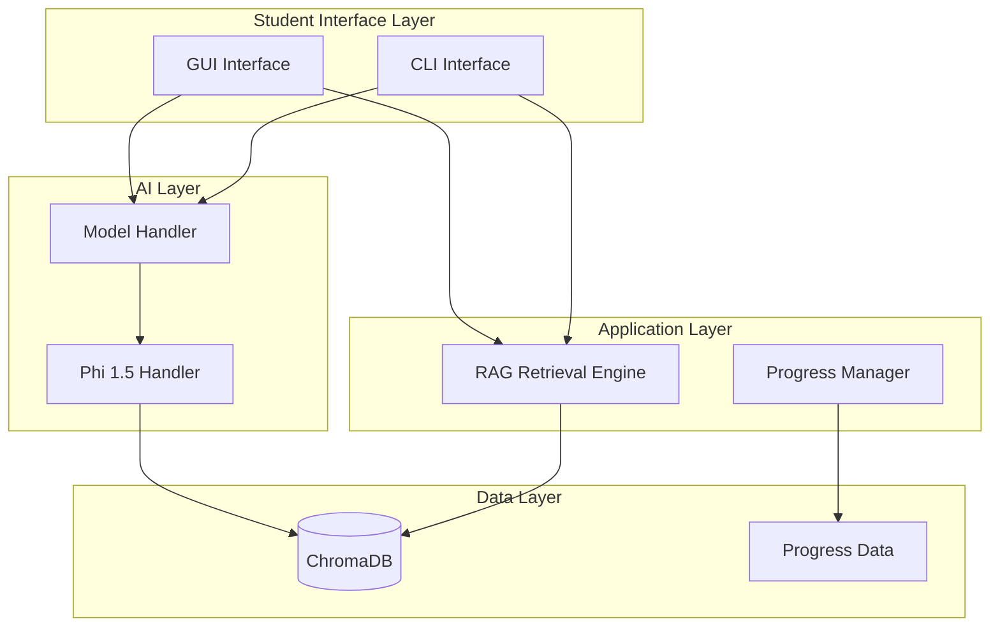

# Technical Implementation Guide

## System Architecture Overview

This document provides a detailed technical overview of the **Satya Learning System**'s architecture, elucidating the structure, function, and interaction of its core components. The architecture is designed to support an **offline-first, RAG-powered learning experience** with a lightweight Phi 1.5 AI model, optimized for **low-end hardware** (4GB RAM minimum).



*Figure 1: High-Level Architecture (Updated for Version 2.0)*

### 1. Universal Content Ingestion

This unified pipeline replaces the previous separated processing scripts, handling textbooks, notes, and handwritten materials in a single pass.

#### 1.1 Ingestion Pipeline (`scripts/ingest_content.py`)

*   **Purpose:** To ingest, process, and index all types of educational content (textbooks, scanned PDFs, handwritten notes) into the RAG system.
*   **Inputs:** PDF, TXT, MD, JSONL files (text or image-based).
*   **Outputs:** Vector embeddings stored in ChromaDB and structured metadata.
*   **Key Processes:**
    *   **Auto-Detection:** Automatically identifies content type (digital text, scanned, or handwritten).
    *   **Extraction:** Uses `PyMuPDF` for clean text; `Tesseract` for scanned docs; `EasyOCR` for handwritten notes.
    *   **Smart Chunking:** Fixed-size chunking (e.g., 512 tokens) with 10% overlap to preserve context.
    *   **Embedding Generation:** Uses `sentence-transformers` (e.g., `all-MiniLM-L6-v2`) to create vector embeddings.
    *   **Storage:** Persists vectors to ChromaDB, organized by subject/collection.
*   **Technology/Implementation Notes:** Key logic resides in `scripts/ingest_content.py`.

#### 1.2 [Merged into Universal Ingestion]
*(Embedding generation is now an integral step of the ingestion pipeline described above.)*

#### 1.3 ChromaDB Vector Database

*   **Purpose:** To store and index all content embeddings for fast, semantic similarity search and retrieval.
*   **Inputs:** Text and image embeddings with associated metadata.
*   **Outputs:** Indexed vector database ready for intelligent content retrieval.
*   **Key Processes:**
    *   Vector storage and indexing.
    *   Metadata management and filtering.
    *   Similarity search algorithms.
    *   Collection organization by subject and content type.
*   **Technology/Implementation Notes:** ChromaDB provides persistent storage and efficient similarity search, located in `satya_data/chroma_db/`.

### 2. AI Model Architecture (Single Phi 1.5 Model)

This segment covers the streamlined AI architecture using a single, lightweight Phi 1.5 model for all AI tasks, replacing the previous multi-model approach.

#### 2.1 Phi 1.5 Model Handler

*   **Purpose:** To manage a single, lightweight Phi 1.5 model that handles all AI tasks including Q&A, hint generation, and content generation with configurable answer lengths.
*   **Inputs:** Student questions, RAG-retrieved context, and answer length preferences.
*   **Outputs:** AI-generated answers, hints, and content with confidence scores.
*   **Key Processes:**
    *   Model loading and optimization for low-end hardware.
    *   Text normalization (handling uppercase, lowercase, mixed case).
    *   Answer length control (5 different detail levels).
    *   Confidence scoring and answer validation.
    *   Fallback mechanisms for error handling.
*   **Technology/Implementation Notes:** Implemented in `ai_model/model_utils/phi15_handler.py`, uses llama-cpp-python for efficient GGUF model inference.

#### 2.2 Model Manager

*   **Purpose:** To provide a unified interface for all AI operations, managing the Phi 1.5 model and coordinating with the RAG system.
*   **Inputs:** Student requests for answers, hints, and content generation.
*   **Outputs:** Coordinated AI responses using RAG context and Phi 1.5 generation.
*   **Key Processes:**
    *   Model lifecycle management.
    *   RAG integration coordination.
    *   Answer length control routing.
    *   Error handling and fallbacks.
*   **Technology/Implementation Notes:** Located in `ai_model/model_utils/model_handler.py`, acts as the central coordinator for AI operations.

### 3. RAG Retrieval Engine

This component provides intelligent content discovery and retrieval, forming the core of the system's content understanding capabilities.

#### 3.1 RAG Retrieval Engine

*   **Purpose:** To intelligently search and retrieve the most relevant content for any student question using semantic similarity and vector search.
*   **Inputs:** Student questions and search parameters.
*   **Outputs:** Ranked, relevant content chunks with relevance scores.
*   **Key Processes:**
    *   Query embedding generation.
    *   Vector similarity search in ChromaDB.
    *   Content ranking and filtering.
    *   Metadata-based content organization.
    *   Fallback to structured content when RAG fails.
*   **Technology/Implementation Notes:** Implemented in `system/rag/rag_retrieval_engine.py`, provides the intelligent content discovery backbone.

### 4. Student Learning Application

This represents the student-facing part of the system with both CLI and GUI interfaces, enhanced with RAG capabilities.

#### 4.1 CLI Learning Application (RAG-Enhanced)

*   **Purpose:** The primary command-line interface through which students interact with the Satya system, now enhanced with RAG-powered content discovery and answer length control.
*   **Inputs:** Student questions, answer length preferences, and navigation commands.
*   **Outputs:** RAG-enhanced answers, progress tracking, and learning analytics.
*   **Key Processes:**
    *   RAG-powered content discovery for questions.
    *   Answer length selection (5 different detail levels).
    *   Phi 1.5 model inference with retrieved context.
    *   Progress tracking and analytics.
    *   Fallback to structured content when needed.
*   **Technology/Implementation Notes:** Enhanced CLI in `student_app/interface/cli_interface.py` with RAG integration and answer length control.

#### 4.2 GUI Learning Application

*   **Purpose:** A modern, responsive graphical interface providing the same RAG-enhanced capabilities with an intuitive user experience.
*   **Inputs:** Student interactions through GUI elements.
*   **Outputs:** Visual learning experience with RAG-enhanced content.
*   **Key Processes:**
    *   Modern customtkinter interface.
    *   RAG integration for intelligent Q&A.
    *   Answer length control through GUI.
    *   Progress visualization and analytics.
*   **Technology/Implementation Notes:** Located in `student_app/gui_app/main_window.py`, provides a rich visual learning experience.

### 5. Content Management and Analytics

This section covers the teacher tools and content management capabilities, enhanced for the new architecture.

#### 5.1 Content Manager

*   **Purpose:** To manage structured educational content and provide fallback content when RAG doesn't find relevant information.
*   **Inputs:** JSON-based structured content files.
*   **Outputs:** Validated content for student learning and RAG fallbacks.
*   **Key Processes:**
    *   Content loading and validation.
    *   Schema enforcement.
    *   Content search and retrieval.
    *   Integration with RAG system.
*   **Technology/Implementation Notes:** Located in `system/data_manager/content_manager.py`, provides the structured content foundation.

#### 5.2 Teacher Tools

*   **Purpose:** To provide teachers with tools for content management, analytics, and system administration.
*   **Inputs:** Teacher commands and content editing requests.
*   **Outputs:** Content updates, student analytics, and system reports.
*   **Key Processes:**
    *   Content editing and validation.
    *   Student progress analytics.
    *   System performance monitoring.
    *   Content quality control.
*   **Technology/Implementation Notes:** Located in `teacher_tools/` directory, provides comprehensive teacher capabilities.

##  Dependencies

### Core Dependencies
```python
llama-cpp-python==0.3.16 # Phi 1.5 model inference
chromadb>=0.4.0          # Vector database
sentence-transformers    # Embedding generation
customtkinter>=5.2.0     # Modern GUI framework
pymupdf>=1.23.0          # PDF processing
```

### Optional OCR Dependencies
```python
pytesseract              # Scanned PDF OCR
easyocr                  # Handwritten notes OCR
Pillow>=9.0.0            # Image processing
```

### CLI/UI Dependencies
```python
rich>=13.3.5             # Enhanced CLI display
prompt_toolkit>=3.0.38   # Advanced CLI input
```

### Testing Dependencies
```python
pytest>=7.3.1            # Testing framework
pytest-cov>=4.1.0        # Coverage reporting
```

## Directory Structure
```
Satya/
├── satya_data/
│   ├── models/
│   │   └── phi_1_5/
│   │       └── phi-1_5.Q4_K_M.gguf
│   ├── chroma_db/                    # ChromaDB collections
│   │   ├── neb_computer_science_grade_10/
│   │   ├── neb_english_grade_10/
│   │   └── neb_science_grade_10/
│   └── content/                      # Educational content
│
├── scripts/
│   ├── ingest_content.py             # Universal ingestion script
│   ├── rag_data_preparation/
│   │   ├── enhanced_chunker.py       # Smart chunking
│   │   ├── embedding_generator.py    # Embedding generationHelpers
│   │   ├── README.md                 # Pipeline documentation
│   │   ├── QUICK_START.md            # Quick start guide
│   │   └── NOTES_GUIDE.md            # Notes vs textbooks guide
│   └── release/
│       ├── run_cli.bat               # Windows CLI launcher
│       ├── run_cli.sh                # Linux/Mac CLI launcher
│       ├── run_gui.bat               # Windows GUI launcher
│       └── run_gui.sh                # Linux/Mac GUI launcher
│
├── system/
│   └── rag/
│       ├── rag_retrieval_engine.py   # RAG engine
│       ├── anti_confusion_engine.py  # Context ranking
│       └── rag_cache.py              # Query caching
│
├── ai_model/
│   └── model_utils/
│       ├── phi15_handler.py          # Phi 1.5 handler
│       └── model_handler.py          # Model manager
│
├── student_app/
│   ├── gui_app/
│   │   ├── main_window.py            # Main GUI
│   │   └── views/
│   │       └── ask_question_view.py  # Question interface
│   └── progress/
│       └── progress_manager.py       # Progress tracking
│
├── textbooks/                        # Textbook PDFs
│   └── grade_10/
│
├── notes/                            # Teacher notes
│   └── grade_10/
│
├── teacher_tools/               # Teacher utilities
├── tests/                      # Test suite
└── docs/                       # Documentation
```

## 🔧 Implementation Details

### 1. Phi 1.5 Model Handler
```python
class Phi15Handler:
    def __init__(self, model_path: str):
        self.model_path = Path(model_path)
        self.llm = None
        self.config = self._load_config()
        self.model_file = self._find_model_file()
    
    def get_answer(self, question: str, context: str, answer_length: str = "medium") -> Tuple[str, float]:
        # Text normalization
        normalized_question = self._normalize_text(question)
        
        # Length-specific prompt generation
        length_config = self._get_length_config(answer_length)
        prompt = self._generate_prompt(context, normalized_question, length_config)
        
        # Model inference
        response = self.llm(prompt, max_tokens=length_config['max_tokens'])
        answer = response['choices'][0]['text'].strip()
        
        # Answer validation and confidence scoring
        confidence = self._calculate_confidence(answer, context, question)
        return answer, confidence
```

### 2. RAG Retrieval Engine
```python
class RAGRetrievalEngine:
    def __init__(self, chroma_db_path: str):
        self.chroma_client = chromadb.PersistentClient(path=chroma_db_path)
        self.collections = self._load_collections()
    
    def retrieve_relevant_content(self, query: str, max_results: int = 5) -> Dict:
        # Generate query embedding
        query_embedding = self.generate_embedding(query)
        
        # Search across all collections
        all_results = []
        for collection_name, collection in self.collections.items():
            results = collection.query(
                query_embeddings=[query_embedding.tolist()],
                n_results=max_results,
                include=['documents', 'metadatas', 'distances']
            )
            # Process and rank results
            all_results.extend(self._process_results(results, collection_name))
        
        # Return top-ranked results
        return {'chunks': all_results[:max_results], 'total_found': len(all_results)}
```

### 3. Answer Length Control
```python
def _get_length_config(self, answer_length: str) -> dict:
    length_configs = {
        "very_short": {
            "instruction": "Give a very brief, one-sentence answer (10-20 words). Focus on the core concept only.",
            "max_tokens": 64,
            "description": "Quick fact or definition"
        },
        "short": {
            "instruction": "Give a concise answer in 2-3 sentences (30-50 words). Include key points and basic explanation.",
            "max_tokens": 128,
            "description": "Basic explanation with key points"
        },
        "medium": {
            "instruction": "Give a detailed answer in 4-6 sentences (80-120 words). Include explanation, examples, and important details.",
            "max_tokens": 256,
            "description": "Detailed explanation with examples"
        },
        "long": {
            "instruction": "Give a comprehensive answer in 8-12 sentences (150-250 words). Include detailed explanation, multiple examples, and step-by-step breakdown.",
            "max_tokens": 512,
            "description": "Comprehensive coverage with examples"
        },
        "very_long": {
            "instruction": "Give an extensive answer in 15-20 sentences (300-500 words). Include comprehensive coverage, multiple perspectives, detailed examples, and thorough explanation.",
            "max_tokens": 1024,
            "description": "Extensive coverage with multiple perspectives"
        }
    }
    return length_configs.get(answer_length, length_configs["medium"])
```

## Critical Implementation Notes

### 1. Model Optimization
- Use GGUF format for Phi 1.5 (lightweight, efficient)
- Optimize for 2GB RAM minimum
- Implement smart text normalization
- Add robust fallback mechanisms

### 2. RAG System
- ChromaDB for vector storage
- Efficient embedding generation
- Smart content retrieval
- Fallback to structured content

### 3. Performance Optimization
- Lazy loading of models and content
- Efficient vector search
- Memory monitoring and optimization
- Caching for frequently accessed content

### 4. Error Handling
- Graceful degradation when RAG fails
- Model fallback mechanisms
- Content validation
- Comprehensive error logging

## Testing Strategy

### 1. Unit Tests
```python
def test_phi15_handler():
    handler = Phi15Handler("test_models/phi_1_5")
    answer, confidence = handler.get_answer("What is AI?", "AI is artificial intelligence", "short")
    assert isinstance(answer, str)
    assert len(answer) > 0
    assert 0.1 <= confidence <= 0.95

def test_rag_engine():
    engine = RAGRetrievalEngine("test_chroma_db")
    results = engine.retrieve_relevant_content("What is computer science?")
    assert 'chunks' in results
    assert len(results['chunks']) > 0
```

### 2. Integration Tests
- End-to-end RAG pipeline
- Model inference with RAG context
- CLI/GUI interaction flow
- Answer length control

### 3. Performance Tests
- Memory usage monitoring
- Response time measurement
- Vector search performance
- Model loading time

## Security Measures

### 1. Content Security
- Input validation and sanitization
- Safe file operations
- Content source validation
- Rate limiting for AI operations

### 2. Data Protection
- Local data storage only
- No external API calls (except optional OpenAI)
- Content encryption for sensitive data
- Backup and recovery systems

## Future Enhancements

### 1. Short-term
- Enhanced RAG capabilities
- Multi-language support
- Advanced answer length control
- Image understanding

### 2. Long-term
- Community content contributions
- Adaptive learning algorithms
- Multi-modal content support
- Advanced analytics

## Deployment Guide

### 1. Prerequisites
- Python 3.8+
- 2GB RAM minimum
- Sufficient disk space for models and content
- llama-cpp-python support

### 2. Installation
```bash
# Create virtual environment
python -m venv venv
source venv/bin/activate  # or venv\Scripts\activate on Windows

# Install dependencies
pip install llama-cpp-python
pip install -r requirements.txt

# Download Phi 1.5 model
# Place phi-1_5-Q5_K_S.gguf in satya_data/models/phi_1_5/
```

### 3. Configuration
```python
# config.py
MODEL_PATH = "satya_data/models/phi_1_5"
CHROMA_DB_PATH = "satya_data/chroma_db"
CONTENT_DIR = "satya_data/content"
```

### 4. Running
```bash
# Start CLI application
python -m student_app.interface.cli_interface

# Start GUI application
python -m student_app.gui_app.main_window

# Run tests
pytest tests/

# Fast launch (packaged scripts)
scripts/release/run_cli.sh   # or run_cli.bat on Windows
scripts/release/run_gui.sh   # or run_gui.bat on Windows

# Build offline bundle (models + content + Chroma)
python scripts/release/build_offline_bundle.py
```

## 🔄 Maintenance

### 1. Regular Tasks
- Content updates and RAG reindexing
- Model performance monitoring
- ChromaDB optimization
- Error log review

### 2. Backup Strategy
- Daily content backups
- Model versioning
- ChromaDB backups
- Configuration backups

## Additional Resources

### 1. Documentation
- Phi 1.5 model documentation
- ChromaDB documentation
- RAG system guides
- User guides and tutorials

### 2. External Links
- Microsoft Phi 1.5 documentation
- ChromaDB documentation
- llama-cpp-python guides
- RAG system research papers

## Known Limitations

### 1. Technical
- Memory usage with large content collections
- Vector search performance with very large databases
- Model accuracy limitations
- Hardware compatibility requirements

### 2. Content
- PDF processing limitations
- Image content constraints
- Language support limitations
- Content update frequency

## Troubleshooting

### 1. Common Issues
- Model loading failures
- ChromaDB connection issues
- Memory errors
- Performance problems

### 2. Solutions
- Model path verification
- ChromaDB initialization
- Memory optimization
- Performance tuning

## What's New in This Architecture

### **Major Changes from Previous Version**
- **Single AI Model**: Replaced multiple models (DistilBERT, T5-small, Phi 2) with one efficient Phi 1.5
- **RAG System**: Added intelligent content discovery and retrieval using ChromaDB
- **Lightweight Design**: Optimized for low-end hardware (2GB RAM minimum)
- **PDF-First Content**: Replaced web crawler with PDF processing pipeline

### **New Technical Features**
- **Vector Database**: ChromaDB for semantic content search
- **Answer Length Control**: 5 different detail levels for varied learning needs
- **Smart Text Normalization**: Handles uppercase, lowercase, and mixed case input
- **RAG-Enhanced Q&A**: Intelligent content discovery for better answers
- **Robust Fallbacks**: Multiple fallback levels ensure students always get help

### 🔧 **Technical Improvements**
- **Offline-First**: 100% local operation, no internet required
- **Performance**: Faster inference with optimized Phi 1.5 parameters
- **Reliability**: Better error handling and confidence scoring
- **Scalability**: Easy to add new subjects and content through RAG

## See also
- [Project Overview](PROJECT_OVERVIEW.md)
- [Project Standards](PROJECT_STANDARDS.md)
- [RAG System Design](RAG_SYSTEM_DESIGN.md) 