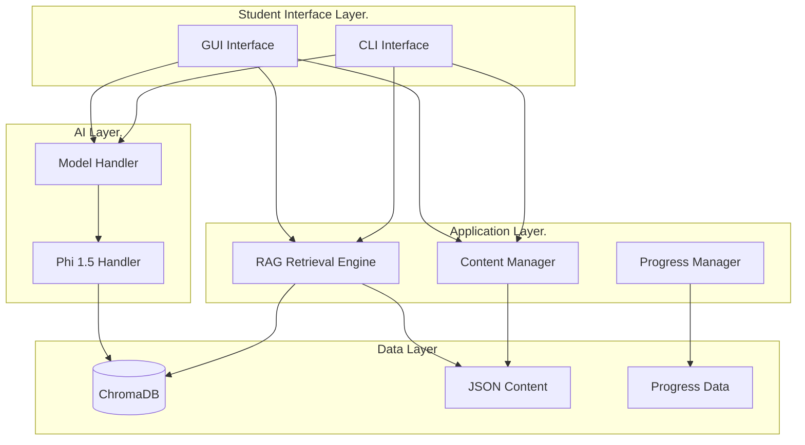

# Satyá: Learning Companion 
<div align="center">
   
   
   [](https://www.python.org/downloads/)
   [](https://opensource.org/licenses/MIT)
   [](https://github.com/aa-sikkkk/Satya)
   [](https://github.com/aa-sikkkk/Satya)

</div>


An intelligent _**learning companion**_, Satya is built with RAG-powered content discovery and Microsoft's efficient Phi 1.5 model. It delivers education that scales from offline rural classrooms to connected urban schools, all while running smoothly on the hardware you already have.

Smart enough to handle complex questions. Efficient enough to work anywhere. Simple enough for anyone to deploy.

</div>

---

## Table of Contents

- [Overview](#overview)
- [Key Features](#key-features)
- [System Architecture](#system-architecture)
- [Technical Specifications](#technical-specifications)
- [Installation](#installation)
- [Quick Start](#quick-start)
- [Usage Guide](#usage-guide)
- [Configuration](#configuration)
- [Performance Optimization](#performance-optimization)
- [Content Management](#content-management)
- [API Reference](#api-reference)
- [Troubleshooting](#troubleshooting)
- [Contributing](#contributing)
- [License](#license)
- [Acknowledgments](#acknowledgments)

---

[](https://www.youtube.com/watch?v=CIUmyQ4sMOo)

## Overview

Satya reimagines AI-powered education for the real world. This comprehensive learning platform is designed for students in Nepal. It brings intelligent tutoring to any environment. Whether in a connected classroom, a rural school, or a home with unreliable internet, Satya aims to support every learner. With RAG-enhanced content discovery and the efficient Phi 1.5 model, Satya transforms how students engage with their curricula.

## The Problem
While AI is transforming education globally, Millions of students still face significant barriers. Unreliable internet, outdated hardware, and weak infrastructure leave them excluded from the benefits of the AI revolution. Most traditional ed-tech solutions assume access to high-speed connections and modern devices, which only widens the gap in educational opportunities.

## The Solution
Satya aims to close the accessibility gap by delivering intelligent learning that works in any environment. Designed for students across Nepal and offering a framework for the world, Satya provides AI-powered tutoring through RAG-enhanced content discovery and Microsoft’s efficient Phi 1.5 model. Whether you are in a well-connected classroom in Kathmandu or a rural village with intermittent power, Satya aims to transform education for everyone.

### Core Principles

- **Offline-First Architecture**: Providing full functionality without requiring a persistent internet connection.
- **Low-Resource Optimization**: Running smoothly on older hardware in rural classrooms, using only a CPU.
- **RAG-Enhanced Intelligence**: Leveraging the ChromaDB vector database for intelligent and efficient content discovery.
- **Single Model Efficiency**: Phi 1.5 model seamlessly handles all AI tasks, including answering questions and offering hints.
- **Community-Driven Content**: Ensuring a transparent and collaborative workflow for content contribution and validation.


## Key Features

### Student-Facing Features

#### RAG-Enhanced Content Discovery

- **Intelligent Semantic Search**: Utilizes the ChromaDB vector database to retrieve relevant content.
- **Context-Aware Answers**: Find and reference appropriate study materials before generating responses.
- **Multi-Source Fallback**: Switches to structured content if RAG retrieval is unsuccessful.
- **Subject-Aware Filtering**: Ensures that related concepts are always drawn from the same subject.

#### AI-Powered Learning Assistance

- **Detailed Question Answering**: Produces comprehensive answers in three to five sentences (80–120 words).
- **Progressive Hint Generation**: Offers context-specific hints to guide student learning.
- **Text Normalization**: Automatically processes input regardless of letter case.
- **Confidence Scoring**: Provides confidence metrics for each generated answer.

#### User Interfaces

- **Command-Line Interface (CLI)**: Features a rich terminal interface with progress indicators.
- **Graphical User Interface (GUI)**: Offers a modern CustomTkinter interface with responsive design.
- **Progress Tracking**: Delivers detailed analytics and visualizations of learning paths.
- **Export/Import**: Enables saving and restoring of learning progress.

  


### Teacher-Facing Features

#### Content Management

- **Structured Content Editor**: Offers a CLI-based editor for educational content creation.
- **Schema Validation**: Performs automated validation using JSON schema.
- **Content Quality Control**: Detects duplicates and validates references.
- **Version Control**: Git-based content versioning

#### Analytics and Monitoring

- **Student Progress Analytics**: Individual Performance metrics
- **Content Usage Statistics**: Track which content is most accessed
- **Performance Monitoring**: System resource usage and response time tracking
- **Error Logging**: Comprehensive audit trails

---

## System Architecture

### High-Level Architecture

> [!IMPORTANT]
> ARCHITECTURE HAS BEEN CHANGED FROM THE PREVIOUS VERSIONS.



### Component Architecture

#### 1. RAG (Retrieval-Augmented Generation) Pipeline

**Components:**

- **PDF Content Processor** (`scripts/rag_data_preparation/pdf_processor.py`)
  - Extracts text and images from PDF documents
  - Performs intelligent chunking with overlap preservation
  - Generates metadata (subject, chapter, page numbers)

- **Embedding Generation Engine** (`scripts/rag_data_preparation/embedding_generator.py`)
  - Converts text chunks to 32-dimensional hash-based embeddings
  - Generates image embeddings using CLIP (optional)
  - Stores embeddings in ChromaDB with metadata

- **ChromaDB Vector Database** (`satya_data/chroma_db/`)
  - Persistent vector storage
  - Efficient similarity search
  - Collection-based organization by subject

#### 2. AI Model Architecture

**Single Phi 1.5 Model Handler** (`ai_model/model_utils/phi15_handler.py`)

- **Model Format**: GGUF (Q4_K_M or Q5_K_M quantization recommended)
- **Context Window**: 1024 tokens (optimized for 4GB RAM)
- **Thread Management**: Auto-detected (CPU cores / 2)
- **Tasks Handled**:
  - Question answering with RAG context
  - Hint generation
  - Content generation

**Model Configuration:**

```python
{
    "n_ctx": 1024,              # Context window
    "n_threads": auto,          # CPU cores / 2
    "n_gpu_layers": 0,          # CPU-only
    "max_tokens": 180,          # Answer generation limit
    "temperature": 0.25,        # Focused generation
    "top_p": 0.9,              # Nucleus sampling
    "repeat_penalty": 1.08     # Repetition control
}
```

#### 3. RAG Retrieval Engine

**Implementation** (`system/rag/rag_retrieval_engine.py`)

- **Query Processing**: Hash-based embedding generation (32D)
- **Vector Search**: ChromaDB similarity search with distance filtering
- **Caching**: LRU cache for queries and embeddings (128 entry limit)
- **Fallback**: Keyword-based BM25-style search when vector search fails

**Retrieval Flow:**

1. Generate query embedding
2. Search across subject collections
3. Filter by distance threshold (0.65)
4. Rank and return top results
5. Fallback to keyword search if no vector matches

#### 4. User Interface Layer

**CLI Interface** (`student_app/interface/cli_interface.py`)

- Rich terminal formatting using `rich` library
- Interactive prompts with `prompt_toolkit.`
- Progress indicators and status messages
- Error handling with user-friendly messages

**GUI Interface** (`student_app/gui_app/main_window.py`)


- CustomTkinter-based modern interface
- Threaded model inference for responsiveness
- Async operations to prevent UI freezing
- Scrollable answer display with word wrapping

---

## Technical Specifications

### Dependencies

#### Core Dependencies

| Package | Version | Purpose |
|---------|---------|---------|
| `llama-cpp-python` | >=0.2.0 | Phi 1.5 model inference |
| `chromadb` | >=0.4.0 | Vector database for RAG |
| `numpy` | >=1.24.3 | Numerical operations |
| `rich` | >=13.3.5 | CLI interface enhancement |
| `prompt-toolkit` | >=3.0.38 | Advanced CLI input |
| `customtkinter` | >=5.2.0 | Modern GUI framework |

#### Optional Dependencies

| Package | Version | Purpose |
|---------|---------|---------|
| `PyMuPDF` | >=1.23.0 | PDF processing |
| `Pillow` | >=9.0.0 | Image processing |
| `pytest` | >=7.3.1 | Testing framework |
| `pytest-cov` | >=4.1.0 | Coverage reporting |

### Performance Targets

| Operation | Target Time | Notes |
|-----------|-------------|-------|
| Model Loading | < 10 seconds | First load only |
| Answer Generation | < 30 seconds | 4GB RAM, CPU-only |
| RAG Retrieval (cached) | < 1 second | With query cache |
| RAG Retrieval (new) | < 3 seconds | Without cache |
| Hints Generation | < 5 seconds | Optimized prompt |
| Memory Usage (peak) | < 2.5GB | During inference |
| CLI Startup | < 5 seconds | With model pre-load |
| GUI Startup | < 10 seconds | With model pre-load |

### File Structure

```
Satya/
├── satya_data/                      # Data and models directory
│   ├── models/
│   │   └── phi_1_5/                 # Phi 1.5 GGUF model
│   │       ├── phi-1_5-Q5_K_S.gguf # Model file
│   │       └── config.json          # Model configuration (optional)
│   ├── chroma_db/                   # RAG vector database
│   │   ├── computer_science_grade_10/
│   │   ├── english_grade_10/
│   │   └── science_grade_10/
│   └── content/                     # Educational content (JSON)
│
├── scripts/
│   ├── rag_data_preparation/        # RAG content processing
│   │   ├── embedding_generator.py   # Generate embeddings
│   │   └── pdf_processor.py         # Process PDFs to chunks
│   ├── data_collection/              # Content collection tools
│   ├── release/                      # Release and packaging
│   │   ├── build_offline_bundle.py  # Create offline bundle
│   │   ├── run_cli.bat              # Windows CLI launcher
│   │   ├── run_cli.sh               # Linux/Mac CLI launcher
│   │   ├── run_gui.bat              # Windows GUI launcher
│   │   ├── run_gui.sh               # Linux/Mac GUI launcher
│   │   └── README.md                # Release documentation
│   └── perf/                         # Performance tools
│       └── bench.py                  # Performance benchmarks
│
├── system/
│   ├── rag/                          # RAG system components
│   │   └── rag_retrieval_engine.py  # Content retrieval engine
│   ├── data_manager/                 # Data handling
│   │   └── content_manager.py       # Content management
│   ├── performance/                  # Performance monitoring
│   │   └── performance_utils.py     # Resource tracking
│   └── security/                     # Security features
│       └── security_utils.py         # Input validation
│
├── ai_model/
│   └── model_utils/                  # Model helper functions
│       ├── phi15_handler.py          # Phi 1.5 model handler
│       └── model_handler.py          # Main model manager
│
├── student_app/
│   ├── gui_app/                      # Modern GUI (CustomTkinter)
│   │   ├── main_window.py            # Main GUI application
│   │   └── views/                    # GUI view components
│   ├── interface/                    # CLI interface components
│   │   └── cli_interface.py         # Main CLI application
│   ├── learning/                     # Learning features
│   └── progress/                     # Progress tracking
│       └── progress_manager.py       # Progress management
│
├── teacher_tools/                    # Teacher utilities
│   └── content_editor/               # Content editing tools
│
├── tests/                            # Test suite
│   ├── test_model_handler.py         # Model handler tests
│   └── test_rag_retrieval_engine.py  # RAG engine tests
│
├── docs/                             # Documentation
│   ├── TECHNICAL_IMPLEMENTATION.md   # Technical details
│   ├── PROJECT_OVERVIEW.md           # Project overview
│   ├── PROJECT_STANDARDS.md          # Coding standards
│   ├── CONTRIBUTING.md               # Contribution guidelines
│   └── STUDENT_GUIDE.md              # Student user guide
│
├── requirements.txt                  # Python dependencies
├── README.md                         # This file
└── LICENSE                           # MIT License
```

---

## Installation

### Prerequisites

- **Python**: 3.8 or higher
- **Operating System**: Windows 10+, Linux (Ubuntu 18.04+), or macOS 10.14+
- **RAM**: 4GB minimum (8GB recommended)
- **Storage**: 5GB free space minimum

### Step-by-Step Installation

#### 1. Clone the Repository

```bash
git clone https://github.com/aa-sikkkk/satya.git
cd Satya
```

#### 2. Create Virtual Environment

**Linux/macOS:**
```bash
python3 -m venv venv
source venv/bin/activate
```

**Windows:**
```cmd
python -m venv venv
venv\Scripts\activate
```

#### 3. Install Dependencies

```bash
pip install --upgrade pip
pip install -r requirements.txt
```

**Note**: For systems with limited resources, you may install minimal dependencies:

```bash
pip install llama-cpp-python chromadb rich prompt-toolkit customtkinter numpy Pillow
```

#### 4. Download Phi 1.5 Model

Download the Phi 1.5 GGUF model and place it in the model directory:

```bash
# Create model directory
mkdir -p satya_data/models/phi_1_5

# Download model (example - adjust URL as needed)
# Recommended: phi-1_5-Q5_K_S.gguf or phi-1_5-Q4_K_M.gguf
# File size: ~1GB for Q5_K_S, ~800MB for Q4_K_M
```

**Model Sources:**
- Hugging Face: [microsoft/phi-1_5](https://huggingface.co/microsoft/phi-1_5)
- Use GGUF quantized versions for optimal performance

#### 5. Initialize ChromaDB (Optional)

If you have pre-processed content, the ChromaDB will be initialized automatically. Otherwise, run:

```bash
python scripts/rag_data_preparation/embedding_generator.py
```

#### 6. Verify Installation

Run the performance benchmark to verify everything works:

```bash
python scripts/perf/bench.py
```

Expected output:
```
== Satya perf smoke ==
model.get_answer: X.XXs | ok=True
rag.retrieve: X.XXs | ok=True
```

---

## Packaging for Distribution

The application can be packaged into standalone executables that **do not require Python** to be installed on the target system. This is ideal for distributing to rural schools where Python may not be available.

### Quick Build

**Windows:**
```cmd
scripts\release\build.bat
```

**Linux/Mac:**
```bash
python scripts/release/build_executables.py
```

This creates standalone executables in `dist/`:
- `SatyaGUI.exe` - Graphical user interface
- `SatyaCLI.exe` - Command-line interface
- `Satya_Standalone/` - Complete distribution package

### System Requirements for Packaged Executables

- **Windows 10 or later** (executables are Windows-specific)
- **4GB RAM minimum** (8GB recommended)
- **2GB free disk space**
- **No Python installation required!**

### Distribution

Simply copy the `dist/Satya_Standalone/` folder to the target system. Users can run `SatyaGUI.exe` or `SatyaCLI.exe` directly without any setup.

For detailed packaging instructions, see [Packaging Guide](docs/PACKAGING.md).

---

## Quick Start

### CLI Mode

```bash
# Using Python module
python -m student_app.interface.cli_interface

# Using launcher script (Windows)
scripts\release\run_cli.bat

# Using launcher script (Linux/Mac)
./scripts/release/run_cli.sh
```

### GUI Mode

```bash
# Using Python module
python -m student_app.gui_app.main_window

# Using launcher script (Windows)
scripts\release\run_gui.bat

# Using launcher script (Linux/Mac)
./scripts/release/run_gui.sh
```

### First Run

1. Enter your username when prompted
2. Select "Ask a Question" from the main menu
3. Type your question (e.g., "What is a computer network?")
4. Wait for the RAG-enhanced answer (typically 15-30 seconds)
5. Review hints and related concepts

---

## Usage Guide


### Student Interface

#### Asking Questions

> [!TIP]
The system supports different subject-related questions. Examples:

- "What is a computer network?"
- "Explain binary number system"
- "What are the elements of a computer network?"

**Answer Generation Process:**

1. **RAG Retrieval**: System searches ChromaDB for relevant content
2. **Context Assembly**: The Top 2 most relevant chunks are selected
3. **Model Inference**: Phi 1.5 generates an answer using the retrieved context
4. **Post-Processing**: Answer is validated, and confidence is calculated
5. **Hints Generation**: Context-specific hints are generated (optional)

#### Browsing Content

Navigate through structured content:

1. Select "Browse Subjects" from the main menu
2. Choose a subject (Computer Science, Science, English)
3. Select a topic
4. Choose a concept to study
5. Review summary and attempt practice questions

#### Progress Tracking

View your learning progress:

1. Select "View Progress" from the main menu
2. Review overall statistics
3. Check subject-wise performance
4. Identify areas for improvement
5. Export progress for backup

### Teacher Interface

#### Content Editing

```bash
python -m teacher_tools.content_editor.content_editor_cli
```

**Features:**
- Create and edit educational content
- Validate content against schema
- Organize content by subject, topic, and concept
- Manage questions and acceptable answers

#### Content Structure

Content follows a hierarchical JSON structure:

```json
{
  "subject": "Computer Science",
  "grade": 10,
  "topics": [
    {
      "name": "Introduction to Computers",
      "subtopics": [
        {
          "name": "Computer Fundamentals",
          "concepts": [
            {
              "name": "What is a Computer",
              "summary": "A computer is an electronic device...",
              "steps": ["Step 1", "Step 2"],
              "questions": [
                {
                  "question": "What is a computer?",
                  "acceptable_answers": ["An electronic device", "A machine that processes data"],
                  "hints": ["Think about devices you use daily", "Consider what computers do"]
                }
              ]
            }
          ]
        }
      ]
    }
  ]
}
```

---

## Configuration

### Model Configuration

Edit `satya_data/models/phi_1_5/config.json` (optional):

```json
{
  "n_ctx": 1024,
  "n_threads": 2,
  "n_gpu_layers": 0,
  "max_tokens": 180,
  "temperature": 0.25,
  "top_p": 0.9,
  "repeat_penalty": 1.08,
  "stop": ["</s>", "\n\nContext:", "\n\nQuestion:", "\n\nQ:", "\n\nProvide"]
}
```

### RAG Configuration

RAG settings are configured in `system/rag/rag_retrieval_engine.py`:

- **Cache Size**: 128 entries (query and embedding caches)
- **Distance Threshold**: 0.65 (filters low-relevance results)
- **Max Results**: 2 chunks per query (optimized for speed)
- **Context Limit**: 600 characters per chunk

### Performance Configuration

For systems with more RAM (8GB+), you can increase:

- `n_ctx`: 1024 → 2048 (larger context window)
- `max_tokens`: 180 → 256 (longer answers)
- Context limit: 600 → 1000 characters

---

## Performance Optimization

### For 4GB RAM Systems

**Current Optimizations:**

1. **Reduced Context Window**: 1024 tokens (vs standard 2048)
2. **Limited Token Generation**: 180 tokens max per answer
3. **Aggressive Context Trimming**: 600 characters max
4. **Minimal RAG Chunks**: Top 2 results only
5. **Fast Confidence Calculation**: Length-based only
6. **Optimized Prompts**: Minimal token count

### For 8GB+ RAM Systems

You can modify these settings in `ai_model/model_utils/phi15_handler.py`:

```python
# In _load_config method
return {
    "n_ctx": 2048,        # Increased from 1024
    "max_tokens": 256,    # Increased from 180
    # ... other settings
}

# In _build_prompt method
if len(trimmed_context) > 1000:  # Increased from 600
    trimmed_context = trimmed_context[:1000] + "..."
```

### Benchmarking

Run performance tests:

```bash
python scripts/perf/bench.py
```

This tests:
- Model loading time
- Answer generation latency
- RAG retrieval speed
- Memory usage

---

## Content Management

### Content Schema

Content must follow the JSON schema defined in `docs/PROJECT_STANDARDS.md`. Key requirements:

- **Required Fields**: `subject`, `grade`, `topics`
- **Subject Values**: `"Computer Science"`, `"Science"`, `"English"`
- **Grade Range**: 1-12
- **Question Structure**: Must include `question`, `acceptable_answers`, `hints`

### Adding New Content

1. Use the content editor CLI
2. Follow the JSON schema
3. Validate content before saving
4. Test content with student interface
5. Commit to version control

### RAG Content Preparation

To add content to the RAG system:

1. **Process PDFs**:
   ```bash
   python scripts/rag_data_preparation/pdf_processor.py
   ```

2. **Generate Embeddings**:
   ```bash
   python scripts/rag_data_preparation/embedding_generator.py
   ```

3. **Verify ChromaDB**:
   ```bash
   python -c "from system.rag.rag_retrieval_engine import RAGRetrievalEngine; r = RAGRetrievalEngine(); print(r.get_statistics())"
   ```

---

## API Reference

### Model Handler

#### `ModelHandler`

**Location**: `ai_model/model_utils/model_handler.py`

**Methods:**

```python
class ModelHandler:
    def __init__(self, model_path: str, enable_streaming: bool = False)
    def get_answer(question: str, context: str, answer_length: str = "medium") -> Tuple[str, float]
    def get_hints(question: str, context: str) -> List[str]
    def get_model_info() -> Dict[str, Any]
    def cleanup()
```

**Example Usage:**

```python
from ai_model.model_utils.model_handler import ModelHandler

handler = ModelHandler("satya_data/models/phi_1_5")
answer, confidence = handler.get_answer(
    "What is a computer network?",
    "A computer network connects devices...",
    "medium"
)
hints = handler.get_hints("What is a computer network?", context)
```

### RAG Retrieval Engine

#### `RAGRetrievalEngine`

**Location**: `system/rag/rag_retrieval_engine.py`

**Methods:**

```python
class RAGRetrievalEngine:
    def __init__(self, chroma_db_path: str = "satya_data/chroma_db", cache_size: int = 128)
    def retrieve_relevant_content(query: str, max_results: int = 5) -> Dict
    def search_content(query: str, subject: str = None, n_results: int = 5) -> List[Dict]
    def get_available_subjects() -> List[str]
    def get_statistics() -> Dict
```

**Example Usage:**

```python
from system.rag.rag_retrieval_engine import RAGRetrievalEngine

rag = RAGRetrievalEngine()
results = rag.retrieve_relevant_content("computer network", max_results=2)
chunks = results['chunks']
```

### Content Manager

#### `ContentManager`

**Location**: `system/data_manager/content_manager.py`

**Methods:**

```python
class ContentManager:
    def __init__(self, content_dir: str)
    def get_all_subjects() -> List[str]
    def get_all_topics(subject: str) -> List[str]
    def get_all_concepts(subject: str, topic: str) -> List[Dict]
    def get_concept(subject: str, topic: str, concept: str) -> Dict
    def search_content(query: str) -> List[Dict]
```

---

## Troubleshooting

### Common Issues

#### Model Loading Fails

**Symptoms**: Error message about model file not found

**Solutions:**
1. Verify model file exists in `satya_data/models/phi_1_5/`
2. Check file name matches expected pattern (`*.gguf`)
3. Ensure sufficient disk space
4. Verify file permissions

#### Slow Answer Generation

**Symptoms**: Answers take more than 1 minute

**Solutions:**
1. Check system RAM usage (should be < 2.5GB during inference)
2. Reduce context window in model config
3. Verify model quantization (use Q4_K_M or Q5_K_S)
4. Close other applications to free memory

#### RAG Retrieval Returns No Results

**Symptoms**: "No relevant content found" messages

**Solutions:**
1. Verify ChromaDB is initialized: `ls satya_data/chroma_db/`
2. Check if collections exist: Run `rag.get_statistics()`
3. Rebuild ChromaDB if needed: Run embedding generator
4. Verify content files exist in `satya_data/content/`

#### GUI Freezes During Answer Generation

**Symptoms**: Interface becomes unresponsive

**Solutions:**
1. This is normal - model inference runs in the background thread
2. Wait for the "Thinking..." spinner to complete
3. If frozen > 2 minutes, check system resources
4. Restart the application if necessary

#### Import Errors

**Symptoms**: `ModuleNotFoundError` or `ImportError.`

**Solutions:**
1. Verify the virtual environment is activated
2. Reinstall dependencies: `pip install -r requirements.txt.`
3. Check Python version: `python --version` (should be 3.8+)
4. Verify all paths are correct

### Performance Debugging

Enable debug logging:

```python
import logging
logging.basicConfig(level=logging.DEBUG)
```

Check resource usage:

```python
from system.performance.performance_utils import log_resource_usage
log_resource_usage("Checkpoint name")
```

### Getting Help

- **Documentation**: See `docs/` directory for detailed guides
- **Issues**: Open an issue on GitHub with:
  - System specifications
  - Error messages
  - Steps to reproduce
  - Log files (if available)

---

## Contributing

### Development Setup

1. Fork the repository
2. Create a feature branch: `git checkout -b feature/your-feature`
3. Follow coding standards in `docs/PROJECT_STANDARDS.md`
4. Write tests for new features
5. Ensure all tests pass: `pytest tests/`
6. Submit a pull request

### Code Standards

- **PEP 8 Compliance**: All Python code must follow PEP 8
- **Type Hints**: Use type hints for all function parameters and returns
- **Docstrings**: Google-style docstrings for all functions and classes
- **Testing**: Minimum 80% test coverage for new code
- **Documentation**: Update relevant documentation files

### Content Contribution

See `docs/CONTRIBUTING.md` for:
- Content structure guidelines
- Validation requirements
- Review process
- Quality standards

---

## License

This project is licensed under the MIT License - see the [LICENSE](LICENSE) file for details.

**Copyright (c) 2024 Satya Project Contributors**

Permission is hereby granted, free of charge, to any person obtaining a copy
of this software and associated documentation files (the "Software"), to deal
in the Software without restriction, including without limitation the rights
to use, copy, modify, merge, publish, distribute, sublicense, and/or sell
copies of the Software, and to permit persons to whom the Software is
furnished to do so, subject to the following conditions:

The above copyright notice and this permission notice shall be included in all
copies or substantial portions of the Software.

---

## Acknowledgments

### Core Technologies

- **Microsoft Phi 1.5**: Lightweight language model powering AI capabilities
- **ChromaDB**: Vector database enabling intelligent content discovery
- **llama-cpp-python**: Efficient GGUF model inference
- **CustomTkinter**: Modern GUI framework
- **Rich**: Enhanced CLI interface library

### Educational Resources

- **readersnepal.com**: Educational content and resources
- **CDC (Curriculum Development Centre)**: Official curriculum materials
- **NEB (National Examination Board)**: Grade 10 curriculum standards

### Community

Special thanks to all contributors, educators, and students who have helped shape Satya into what it is today.

---

## Version History

### Current Version: 2.0

**Major Changes:**
- Single Phi 1.5 model architecture (replaced multi-model approach)
- RAG system integration with ChromaDB
- Optimized for 4GB RAM systems
- Performance improvements (30-50% faster)
- Enhanced answer quality with context-aware generation

**Previous Versions:**
- Version 1.0: Initial release with multi-model architecture

---

## Additional Resources

### Documentation

- [Technical Implementation Guide](docs/TECHNICAL_IMPLEMENTATION.md)
- [Project Overview](docs/PROJECT_OVERVIEW.md)
- [Project Standards](docs/PROJECT_STANDARDS.md)
- [Student Guide](docs/STUDENT_GUIDE.md)
- [Teacher Guide](docs/TEACHER_GUIDE.md)
- [Contributing Guidelines](docs/CONTRIBUTING.md)

### External Links

- [Project Repository](https://github.com/aa-sikkkk/satya)
- [Microsoft Phi 1.5 Documentation](https://huggingface.co/microsoft/phi-1_5)
- [ChromaDB Documentation](https://docs.trychroma.com/)
- [llama-cpp-python Documentation](https://github.com/abetlen/llama-cpp-python)

---

*Pioneering accessible, intelligent AI education in Nepal with community power and RAG technology.*
