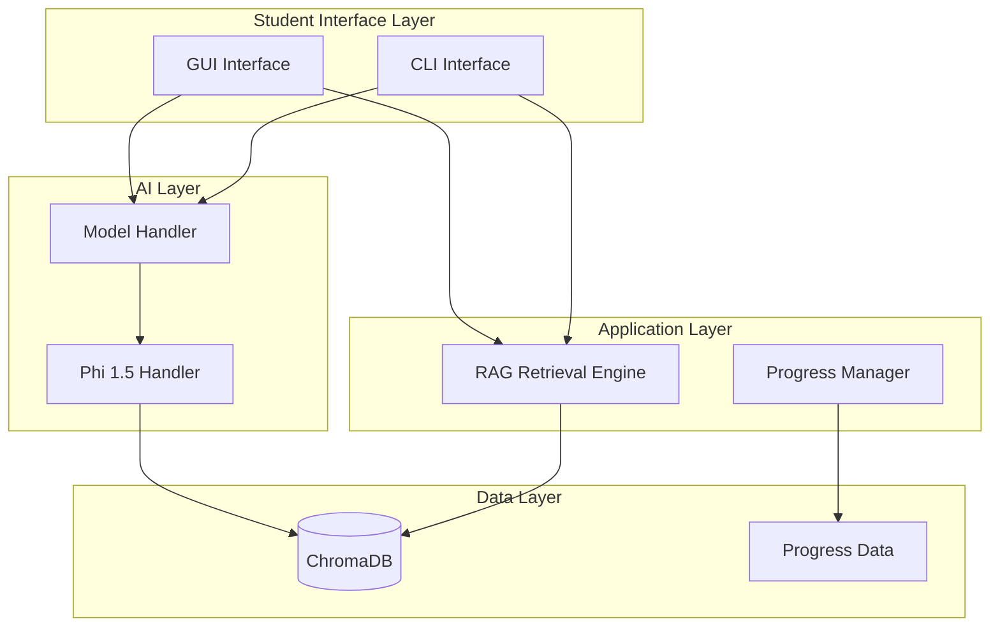

# Satyá: Learning Companion 

<div align="center">
    
   
   [](https://www.python.org/downloads/)
   [](https://opensource.org/licenses/MIT)
   [](https://github.com/aa-sikkkk/Satya)
   [](https://github.com/aa-sikkkk/Satya)
</div>

An intelligent **learning companion** built with RAG-powered content discovery and Microsoft's efficient Phi 1.5 model. Delivers education that scales from offline rural classrooms to connected urban schools, all while running smoothly on the hardware you already have.

Smart enough to handle complex questions. Efficient enough to work anywhere. Simple enough for anyone to deploy.

---

## Table of Contents

- [Overview](#overview)
- [Key Features](#key-features)
- [System Architecture](#system-architecture)
- [Technical Specifications](#technical-specifications)
- [Installation](#installation)
- [Quick Start](#quick-start)
- [Content Management](#content-management)
- [Usage Guide](#usage-guide)
- [API Reference](#api-reference)
- [Troubleshooting](#troubleshooting)
- [Contributing](#contributing)
- [License](#license)

---

[](https://www.youtube.com/watch?v=QSHH5KpM2A8)

## Overview

Satya reimagines AI-powered education for the real world. This comprehensive learning platform is designed for students in Nepal, bringing intelligent tutoring to any environment. Whether in a connected classroom, a rural school, or a home with unreliable internet, Satya supports every learner with RAG-enhanced content discovery and the efficient Phi 1.5 model.

---

## Mission & Vision

### Our Mission

**To democratize AI-powered education by making intelligent tutoring accessible to every student, regardless of their location, internet connectivity, or hardware resources.**

Satya exists to bridge the digital divide in education. While AI transforms learning in well-connected urban centers, millions of students in rural areas remain excluded. We believe every student deserves access to intelligent, personalized learning assistance—not just those with high-speed internet and modern devices.

### The Educational Crisis

> [!IMPORTANT]
> **2.9 billion people** worldwide lack reliable internet access. In Nepal alone, **60% of students** study in rural areas with limited connectivity and outdated hardware.

**Current barriers to AI education:**

- **Infrastructure Gap** - Rural schools lack reliable electricity and internet
- **Hardware Limitations** - Most schools have 4-8GB RAM computers from 2010-2015
- **Cost Barriers** - Cloud-based AI solutions require expensive subscriptions
- **Connectivity Dependence** - Existing ed-tech assumes constant internet access
- **Resource Inequality** - Urban students get AI tutors; rural students get textbooks

**The result:** Educational inequality widens as AI advances accelerate in privileged areas while underserved communities fall further behind.

### Our Solution: Offline-First AI Education

Satya breaks down these barriers through **radical accessibility**:

**1. Offline-First Architecture**
- Complete functionality without internet connection
- One-time download, lifetime offline use
- No cloud dependencies or subscription fees

**2. Low-Resource Optimization**
- Runs on 4GB RAM with CPU-only processing
- Works on decade-old hardware common in rural schools
- Optimized for 3rd gen Intel i3 processors

**3. Intelligent RAG System**
- Local vector database (ChromaDB) for content discovery
- Searches textbooks and teacher notes simultaneously
- Context-aware answers without external APIs

**4. Single Model Efficiency**
- Microsoft Phi 1.5 (800MB) handles all AI tasks
- No multiple models or complex pipelines
- Fast inference optimized for limited resources

**5. Community-Driven Content**
- Teachers contribute local curriculum materials
- Supports PDFs, scanned documents, handwritten notes
- Transparent, collaborative content workflow

### Impact & Reach

**Target Beneficiaries:**

- **Primary:** 500,000+ Grade 10 students in Nepal
- **Secondary:** Rural schools across South Asia
- **Tertiary:** Any educational institution with limited resources

**Measurable Outcomes:**

- **Accessibility:** AI tutoring available 24/7 without internet
- **Equity:** Same quality education in rural and urban areas
- **Affordability:** Zero ongoing costs after initial setup
- **Scalability:** One teacher can prepare content for thousands of students
- **Sustainability:** Community-maintained, open-source platform

### Design Philosophy

> [!NOTE]
> Every technical decision in Satya prioritizes **accessibility over performance**, **simplicity over features**, and **offline capability over cloud convenience**.

**Core Principles:**

1. **Offline-First** - Internet is optional, not required
2. **Resource-Conscious** - Optimized for the hardware students actually have
3. **Educator-Empowered** - Teachers control content, not corporations
4. **Student-Centered** - Learning experience over technical complexity
5. **Community-Driven** - Transparent, collaborative development

### Why This Matters

**Education is a fundamental right, not a privilege.** AI-powered learning should be accessible to every student, not just those in well-connected urban centers.

Satya proves that **intelligent, personalized education doesn't require expensive infrastructure**. With thoughtful engineering and community collaboration, we can deliver AI tutoring to the students who need it most—those currently excluded from the AI revolution.

**This isn't just about technology. It's about educational justice.**


---

## Key Features

### Student-Facing Features

#### RAG-Enhanced Content Discovery

- **Intelligent Semantic Search** - ChromaDB vector database retrieves relevant content
- **Context-Aware Answers** - References appropriate study materials before generating responses
- **Multi-Source Retrieval** - Searches both textbooks and teacher notes
- **Subject-Aware Filtering** - Ensures related concepts from same subject
- **Progressive Status Updates** - Real-time feedback during retrieval

> [!TIP]
> The RAG system searches both textbooks and notes collections automatically, providing comprehensive answers from multiple sources.

#### AI-Powered Learning Assistance

- **Detailed Answers** - Generates 3-4 informative sentences (100-150 tokens)
- **Real-Time Streaming** - Token-by-token display for immediate feedback
- **Confidence Scoring** - Shows warning only when confidence < 70%
- **Text Normalization** - Processes input regardless of letter case
- **Hint Generation** - Context-specific hints to guide learning

#### User Interfaces

- **Command-Line Interface (CLI)** - Rich terminal interface with progress indicators
- **Graphical User Interface (GUI)** - Modern CustomTkinter interface with responsive design
- **Progress Tracking** - Detailed analytics and visualizations
- **Export/Import** - Save and restore learning progress
- 
[](https://www.youtube.com/watch?v=QSHH5KpM2A8)


### Teacher-Facing Features

#### Content Management

- **Universal Ingestion** - Single script handles PDFs, scanned documents, handwritten notes
- **Auto-Detection** - Automatically detects content type and applies appropriate processing
- **OCR Support** - Tesseract for scanned PDFs, EasyOCR for handwritten notes
- **Smart Chunking** - 512 tokens with 10% overlap for optimal retrieval
- **Metadata Extraction** - Auto-detects grade and subject from folder structure

> [!NOTE]
> Use `scripts/ingest_content.py` for all content ingestion. It replaces all previous ingestion scripts.

---

## System Architecture

### High-Level Architecture

> [!IMPORTANT]
> Architecture has been updated in version 2.0. Single Phi 1.5 model replaces previous multi-model approach.



### Component Architecture

#### 1. Universal Content Ingestion

**Implementation** (`scripts/ingest_content.py`)

- **Auto-Detection** - Identifies text PDFs, scanned PDFs, or handwritten notes
- **Multi-Format Support** - PDF, TXT, MD, JSONL
- **OCR Modes** - Auto-detect, force, or never
- **Smart Processing** - PyMuPDF for text, Tesseract/EasyOCR for images

**Processing Flow:**

```
Input Files (PDF/TXT/MD)
    ↓
Content Type Detection
    ↓
Extraction (PyMuPDF/Tesseract/EasyOCR)
    ↓
Smart Chunking (512 tokens, 10% overlap)
    ↓
Embedding Generation (all-MiniLM-L6-v2)
    ↓
ChromaDB Storage
```

#### 2. RAG Retrieval Engine

**Implementation** (`system/rag/rag_retrieval_engine.py`)

- **Query Processing** - Embedding generation with sentence-transformers
- **Vector Search** - ChromaDB similarity search across collections
- **Confidence Calculation** - Considers answer length, relevance, and RAG context quality
- **Progressive UX** - Real-time status updates during retrieval

**Retrieval Flow:**

1. Show "Searching knowledge base..."
2. Generate query embedding
3. Show "Analyzing your question..."
4. Search across subject collections
5. Show "Finding best matches..."
6. Rank and filter results
7. Show "Generating answer..."
8. Stream tokens in real-time

> [!TIP]
> The system provides progressive status updates to make the 10-12 second retrieval feel faster.

#### 3. AI Model Architecture

**Single Phi 1.5 Model Handler** (`ai_model/model_utils/phi15_handler.py`)

- **Model Format** - GGUF (Q4_K_M quantization)
- **Context Window** - 384 tokens (optimized for i3 CPU)
- **Thread Management** - Auto-detected based on CPU cores
- **Streaming** - Real-time token-by-token generation

**Model Configuration:**

```python
{
    "n_ctx": 384,              # Context window
    "n_threads": auto,         # CPU cores / 2
    "n_gpu_layers": 0,         # CPU-only
    "max_tokens": 250,         # Balanced for 3-4 sentences
    "temperature": 0.5,        # Focused generation
    "top_p": 0.9,             # Nucleus sampling
    "repeat_penalty": 1.08    # Repetition control
}
```

---

## Technical Specifications

### Dependencies

#### Core Dependencies

| Package | Version | Purpose |
|---------|---------|---------|
| `llama-cpp-python` | 0.3.16 | Phi 1.5 model inference |
| `chromadb` | >=0.4.0 | Vector database for RAG |
| `sentence-transformers` | latest | Embedding generation |
| `customtkinter` | >=5.2.0 | Modern GUI framework |
| `pymupdf` | >=1.23.0 | PDF processing |

#### Optional OCR Dependencies

| Package | Version | Purpose |
|---------|---------|---------|
| `pytesseract` | latest | Scanned PDF OCR |
| `easyocr` | latest | Handwritten notes OCR |
| `Pillow` | >=9.0.0 | Image processing |

### Performance Targets

| Operation | Target Time | Hardware |
|-----------|-------------|----------|
| Model Loading | < 5 seconds | First load only |
| RAG Retrieval | 10-12 seconds | i3 CPU, 4GB RAM |
| Token Streaming | Immediate | After retrieval |
| Answer Generation | 5-8 seconds | Streaming mode |
| Memory Usage (peak) | < 2GB | During inference |

> [!NOTE]
> On 3rd gen i3 CPU with 4GB RAM, expect 10-12 second TTFT (Time To First Token). This is normal for quality RAG on CPU-only systems.

### File Structure

```
Satya/
├── satya_data/
│   ├── models/
│   │   └── phi_1_5/
│   │       └── phi-1_5.Q4_K_M.gguf
│   ├── chroma_db/                    # ChromaDB collections
│   │   ├── neb_computer_science_grade_10/
│   │   ├── neb_english_grade_10/
│   │   └── neb_science_grade_10/
│   └── content/                      # Educational content
│
├── scripts/
│   ├── ingest_content.py             # Universal ingestion script
│   ├── rag_data_preparation/
│   │   ├── enhanced_chunker.py       # Smart chunking
│   │   ├── embedding_generator.py    # Embedding generation
│   │   ├── README.md                 # Pipeline documentation
│   │   ├── QUICK_START.md            # Quick start guide
│   │   └── NOTES_GUIDE.md            # Notes vs textbooks guide
│   └── release/
│       ├── run_cli.bat               # Windows CLI launcher
│       ├── run_cli.sh                # Linux/Mac CLI launcher
│       ├── run_gui.bat               # Windows GUI launcher
│       └── run_gui.sh                # Linux/Mac GUI launcher
│
├── system/
│   └── rag/
│       ├── rag_retrieval_engine.py   # RAG engine
│       ├── anti_confusion_engine.py  # Context ranking
│       └── rag_cache.py              # Query caching
│
├── ai_model/
│   └── model_utils/
│       ├── phi15_handler.py          # Phi 1.5 handler
│       └── model_handler.py          # Model manager
│
├── student_app/
│   ├── gui_app/
│   │   ├── main_window.py            # Main GUI
│   │   └── views/
│   │       └── ask_question_view.py  # Question interface
│   └── progress/
│       └── progress_manager.py       # Progress tracking
│
├── textbooks/                        # Textbook PDFs
│   └── grade_10/
│
├── notes/                            # Teacher notes
│   └── grade_10/
│
├── requirements.txt
├── README.md
└── LICENSE
```

---

## Installation

### Prerequisites

- **Python** - 3.8 or higher
- **Operating System** - Windows 10+, Linux (Ubuntu 18.04+), or macOS 10.14+
- **RAM** - 4GB minimum (8GB recommended)
- **Storage** - 5GB free space minimum

### Step-by-Step Installation

#### 1. Clone the Repository

```bash
git clone https://github.com/aa-sikkkk/satya.git
cd Satya
```

#### 2. Create Virtual Environment

**Linux/macOS:**
```bash
python3 -m venv venv
source venv/bin/activate
```

**Windows:**
```cmd
python -m venv venv
venv\Scripts\activate
```

#### 3. Install Dependencies

```bash
pip install --upgrade pip
pip install -r requirements.txt
```

> [!TIP]
> For OCR support, install optional dependencies:
> ```bash
> pip install pytesseract pillow easyocr
> ```

#### 4. Download Phi 1.5 Model

Download the Phi 1.5 GGUF model:

```bash
# Create model directory
mkdir -p satya_data/models/phi_1_5

# Download model (Q4_K_M quantization recommended)
# File size: ~800MB
```

**Model Sources:**
- Hugging Face: [microsoft/phi-1_5](https://huggingface.co/microsoft/phi-1_5)
- Use GGUF quantized versions (Q4_K_M or Q5_K_S)

> [!IMPORTANT]
> Place the model file in `satya_data/models/phi_1_5/` and ensure it has a `.gguf` extension.

#### 5. Verify Installation

```bash
python -m py_compile ai_model/model_utils/phi15_handler.py
python -m py_compile system/rag/rag_retrieval_engine.py
```

---

## Quick Start

### CLI Mode

```bash
# Using Python module
python -m student_app.interface.cli_interface

# Using launcher script (Windows)
scripts\release\run_cli.bat

# Using launcher script (Linux/Mac)
./scripts/release/run_cli.sh
```

### GUI Mode

```bash
# Using Python module
python -m student_app.gui_app.main_window

# Using launcher script (Windows)
scripts\release\run_gui.bat

# Using launcher script (Linux/Mac)
./scripts/release/run_gui.sh
```

> [!NOTE]
> First run will take 5-10 seconds to load the model. Subsequent runs are faster.

---

## Content Management

### Adding Educational Content

> [!IMPORTANT]
> Use the universal ingestion script for all content types. It replaces all previous ingestion scripts.

#### Quick Start

**Process all content (textbooks + notes):**
```bash
python scripts/ingest_content.py
```

**Process only textbooks:**
```bash
python scripts/ingest_content.py --input textbooks
```

**Process only notes:**
```bash
python scripts/ingest_content.py --input notes
```

#### OCR Modes

**Auto-detect (recommended):**
```bash
python scripts/ingest_content.py --ocr-mode auto
```

**Force OCR on all PDFs:**
```bash
python scripts/ingest_content.py --ocr-mode force
```

**Never use OCR (text-only):**
```bash
python scripts/ingest_content.py --ocr-mode never
```

### Content Organization

**Textbooks:**
```
textbooks/grade_10/
├── computer_science.pdf
├── english.pdf
└── science.pdf
```

**Notes:**
```
notes/grade_10/
├── cs_notes.pdf
├── english_summary.md
└── science_revision.txt
```

> [!TIP]
> The system auto-detects grade from folder structure and subject from filename.

### Verification

```python
import chromadb

client = chromadb.PersistentClient(path='satya_data/chroma_db')
collections = client.list_collections()

for c in collections:
    print(f"{c.name}: {c.count()} chunks")
```

### Documentation

- **Detailed guide:** `scripts/rag_data_preparation/README.md`
- **Quick start:** `scripts/rag_data_preparation/QUICK_START.md`
- **Strategy guide:** `scripts/rag_data_preparation/NOTES_GUIDE.md`
- **Textbooks README:** `textbooks/README.md`
- **Notes README:** `notes/README.md`

---

## Usage Guide

### Student Interface

#### Asking Questions

The system supports subject-related questions:

- "What is a computer network?"
- "Explain binary number system"
- "What are the elements of a computer network?"

**Answer Generation Process:**

1. **Searching knowledge base...** - Initial feedback
2. **Analyzing your question...** - Embedding generation
3. **Finding best matches...** - ChromaDB search
4. **Generating answer...** - Model inference begins
5. **Token streaming** - Real-time answer display

> [!TIP]
> The progressive status updates make the 10-12 second retrieval feel faster by showing what's happening.

#### Confidence Display

The system only shows confidence warnings when needed:

- **Confidence ≥ 70%** - No indicator (clean interface)
- **40-70%** - Warning: Moderate confidence
- **< 40%** - Warning: Low confidence - please verify

---

## API Reference

### Model Handler

#### `ModelHandler`

**Location:** `ai_model/model_utils/model_handler.py`

```python
from ai_model.model_utils.model_handler import ModelHandler

handler = ModelHandler("satya_data/models/phi_1_5")
answer, confidence = handler.get_answer(
    "What is a computer network?",
    "A computer network connects devices...",
    "medium"
)
```

### RAG Retrieval Engine

#### `RAGRetrievalEngine`

**Location:** `system/rag/rag_retrieval_engine.py`

```python
from system.rag.rag_retrieval_engine import RAGRetrievalEngine

rag = RAGRetrievalEngine()
result = rag.query(
    query_text="What is a variable?",
    subject="computer_science"
)

print(f"Answer: {result['answer']}")
print(f"Confidence: {result['confidence']}")
```

---

## Troubleshooting

### Common Issues

#### Model Loading Fails

> [!WARNING]
> Ensure model file exists in `satya_data/models/phi_1_5/` with `.gguf` extension.

**Solutions:**
1. Verify model file exists
2. Check file permissions
3. Ensure sufficient disk space

#### Slow Answer Generation

> [!NOTE]
> On i3 CPU with 4GB RAM, 10-12 second TTFT is normal for quality RAG retrieval.

**Optimization:**
1. Close other applications
2. Verify model quantization (Q4_K_M recommended)
3. Check system RAM usage

#### RAG Retrieval Returns No Results

**Solutions:**
1. Verify ChromaDB exists: `ls satya_data/chroma_db/`
2. Check collections: Run ingestion script
3. Verify content files exist

#### GUI Freezes During Generation

> [!NOTE]
> This is normal - model inference runs in background thread. Wait for completion.

---

## Contributing

### Development Setup

1. Fork the repository
2. Create feature branch: `git checkout -b feature/your-feature`
3. Follow coding standards
4. Write tests for new features
5. Submit pull request

### Content Contribution

See documentation:
- `scripts/rag_data_preparation/README.md`
- `scripts/rag_data_preparation/NOTES_GUIDE.md`

---

## License

MIT License - see [LICENSE](LICENSE) file for details.

**Copyright (c) 2024 Satya Project Contributors**

---

## Acknowledgments

### Core Technologies

- **Microsoft Phi 1.5** - Lightweight language model ([MIT License](https://huggingface.co/microsoft/phi-1_5))
- **ChromaDB** - Vector database for RAG ([Apache 2.0](https://github.com/chroma-core/chroma))
- **llama-cpp-python** - Efficient GGUF inference ([MIT License](https://github.com/abetlen/llama-cpp-python))
- **CustomTkinter** - Modern GUI framework ([MIT License](https://github.com/TomSchimansky/CustomTkinter))
- **sentence-transformers** - Embedding generation ([Apache 2.0](https://github.com/UKPLab/sentence-transformers))

### Knowledge Base Datasets

Satya's knowledge base is built using the following open-source educational datasets:

#### Science & Mathematics

- **[OpenStax Science](https://openstax.org/)** 
  - Open-source college textbooks (Biology, Physics, Chemistry)
  - License: [CC BY 4.0](https://creativecommons.org/licenses/by/4.0/)
  - Used for: General science concepts across all grades

- **[ScienceQA](https://scienceqa.github.io/)** 
  - Multi-modal science question answering dataset
  - License: [CC BY-NC-SA 4.0](https://creativecommons.org/licenses/by-nc-sa/4.0/)
  - Used for: Science problem-solving and explanations

- **[FineMath](https://huggingface.co/datasets/HuggingFaceTB/finemath)** 
  - High-quality mathematical reasoning dataset
  - License: [ODC-By](https://opendatacommons.org/licenses/by/1-0/)
  - Used for: Mathematical concepts and problem-solving

- **[GSM8K](https://github.com/openai/grade-school-math)** 
  - Grade school math word problems
  - License: [MIT License](https://opensource.org/licenses/MIT)
  - Used for: Step-by-step math problem solving

#### Computer Science

- **CS Stanford** (`cs_stanford` collection)
  - Source: [HuggingFaceTB/cosmopedia](https://huggingface.co/datasets/HuggingFaceTB/cosmopedia) (Stanford seed data)
  - Synthetic textbook content for computer science and STEM
  - License: [Apache 2.0](https://www.apache.org/licenses/LICENSE-2.0)
  - Used for: Programming concepts and CS fundamentals

#### Language & General Education

- **FineWeb-Edu** (`fineweb_edu` collection)
  - Source: [HuggingFaceFW/fineweb-edu](https://huggingface.co/datasets/HuggingFaceFW/fineweb-edu)
  - High-quality educational web content
  - License: [ODC-By](https://opendatacommons.org/licenses/by/1-0/)
  - Used for: English language and general knowledge

- **Khan Academy Pedagogy** (`khanacademy_pedagogy` collection)
  - Source: [HuggingFaceTB/cosmopedia](https://huggingface.co/datasets/HuggingFaceTB/cosmopedia) (Khan Academy seed data)
  - Synthetic educational content with narrative teaching style
  - License: [Apache 2.0](https://www.apache.org/licenses/LICENSE-2.0)
  - Used for: Conceptual explanations across subjects


> [!NOTE]
> All datasets are used in accordance with their respective licenses. We acknowledge and thank the creators and maintainers of these invaluable educational resources.

### NEB Curriculum Content

In addition to the above datasets, Satya supports **Nepal Education Board (NEB) curriculum-specific content** through teacher-contributed materials:

- Grade-specific textbooks (Grades 8-12)
- Teacher notes and study materials
- Local curriculum alignment

These materials are ingested separately and stored in grade-specific collections (e.g., `neb_biology_grade_10`).

### Community

Special thanks to:
- **Educators** who contribute curriculum materials
- **Students** who provide feedback and testing
- **Open-source contributors** who improve the codebase
- **Dataset creators** who make educational AI possible

---

## Version History

### Current Version: 2.1 (January 2026)

**Major Features:**
- **Input Normalization System** - Production-ready adaptive learning layer
  - Rule-based core with 4-layer noise removal
  - LanguageTool integration (offline grammar/spell correction)
  - Automated pattern mining from production logs
  - Human-in-the-loop learning workflow
- **Enhanced RAG Architecture**
  - 7 HuggingFace datasets (OpenStax, ScienceQA, FineMath, GSM8K, etc.)
  - Subject-based collection selection (NEB: grade+subject, HuggingFace: subject only)
  - Semantic caching for faster responses
- **Single Phi 1.5 Model** - Optimized for i3 CPU (4GB RAM)
  - Real-time token streaming
  - Context window: 384 tokens
  - Q4_K_M quantization (~800MB)
- **Universal Content Ingestion** - Single script for all content types
  - OCR support (Tesseract + EasyOCR)
  - Smart chunking (512 tokens, 10% overlap)
  - Auto-detection of PDFs, text, markdown
- **Progressive UX** - Real-time status updates during retrieval
- **Comprehensive Testing** - 15/15 end-to-end tests passing

**Performance:**
- RAG retrieval: 10-12 seconds (i3 CPU)
- Token streaming: Immediate after retrieval
- Memory usage: <2GB peak
- Code reduction: 43% fewer lines (cleaner, modular)

### Version 1.0 (2024)

- Initial release with multi-model architecture
- Basic RAG implementation
- CLI and GUI interfaces
- Local ChromaDB integration

---

*Pioneering accessible, intelligent AI education in Nepal with community power and RAG technology.*

